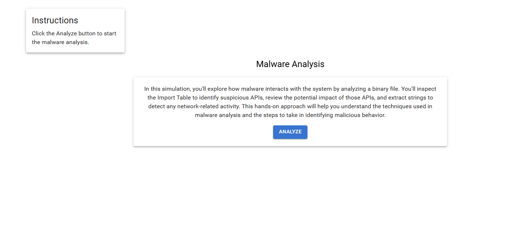
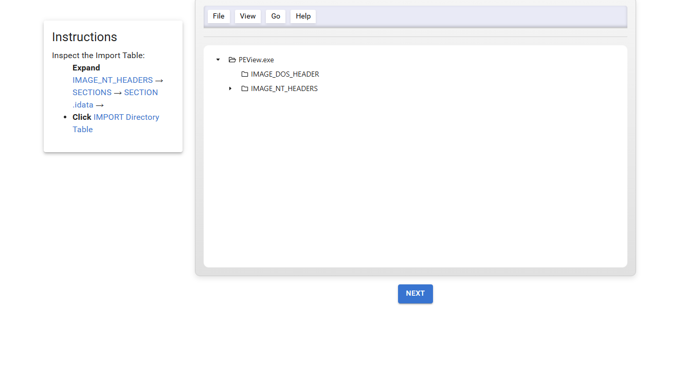
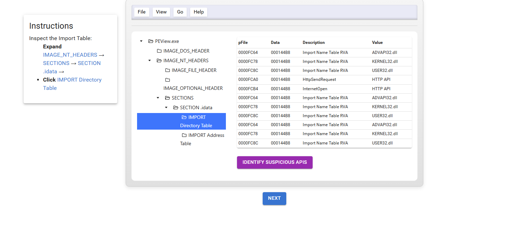
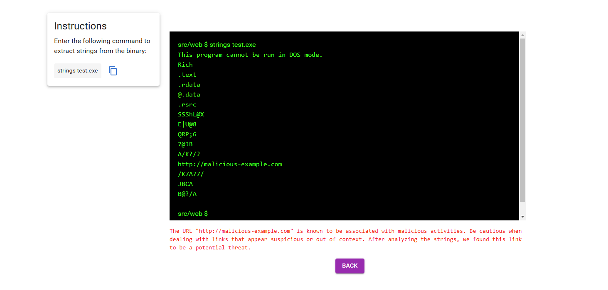

### Procedure

<strong>Step 1:</strong> Read the instruction displayed in the simulation and click the <strong>Analyze</strong> button to proceed to the next step.

<strong>Step 2:</strong> Read the instruction carefully. Inspect the <strong>Import Table</strong> and navigate through the given directories as instructed.

<strong>Step 3:</strong> Click on <strong>Identify Suspicious APIs</strong>, observe the results, and read the explanation to understand how it works.

<strong>Step 4:</strong> Read the instruction, copy the given command, paste it into the terminal, and run it.

