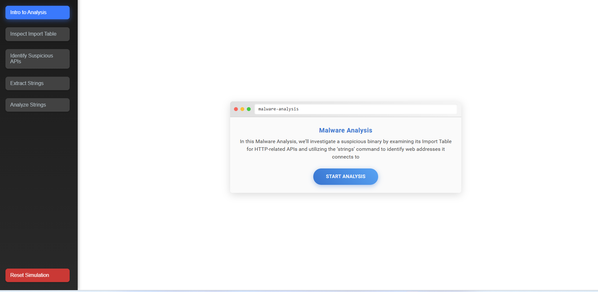
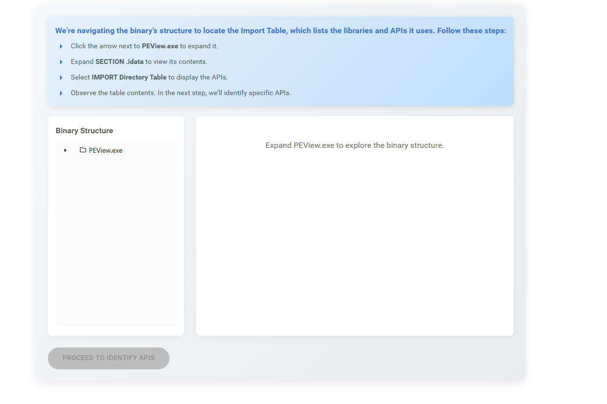
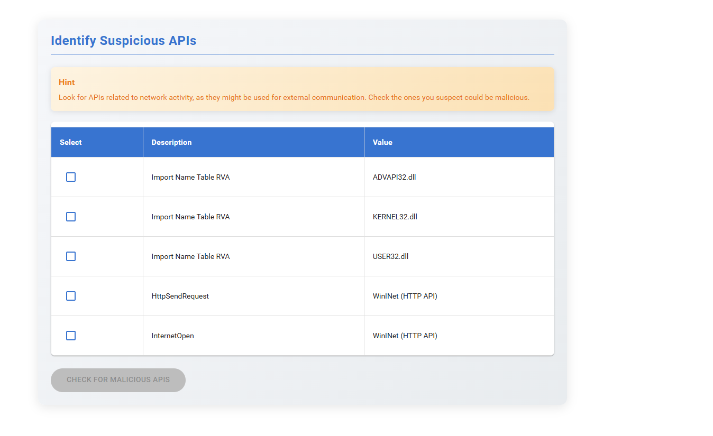
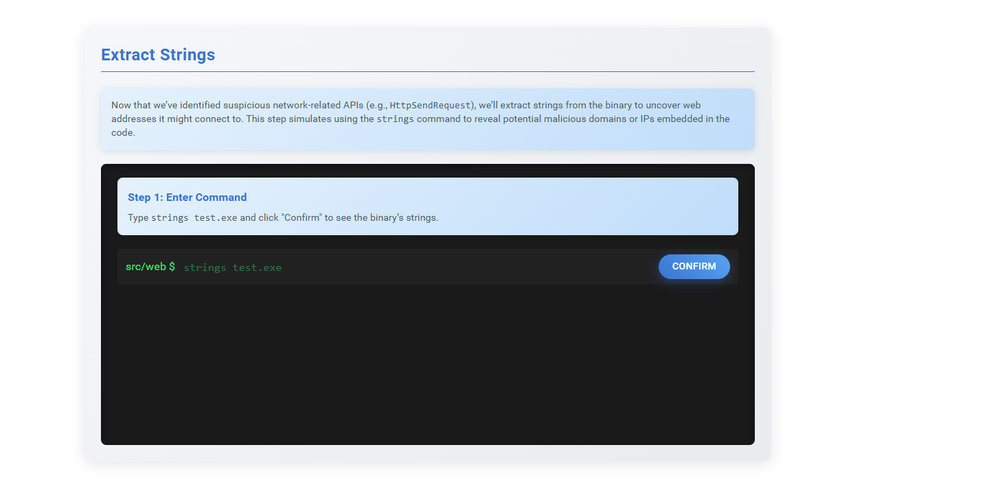
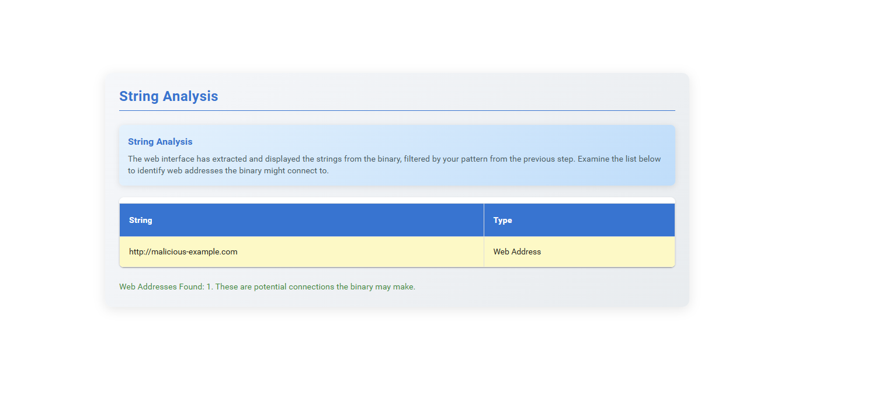

### Procedure

<strong>Step 1:</strong> Read the instructions displayed in the simulation and click the <strong>Start</strong> button to proceed to the next step.

  

<strong>Step 2:</strong> Read the instructions carefully. Inspect the <strong>Import Table</strong> and navigate through the given directories as instructed.
 

 
<strong>Step 3:</strong> Select the given APIs, identify the suspicious APIs, and click the <strong>Check for Malicious APIs</strong> button. Observe the results and read the explanation to understand how it works.
 
 

<strong>Step 4:</strong> Read the instructions, copy the given command, paste it into the terminal, and run it.
 
 
<strong>Step 5:</strong> Observe the results from the previous step.

 
